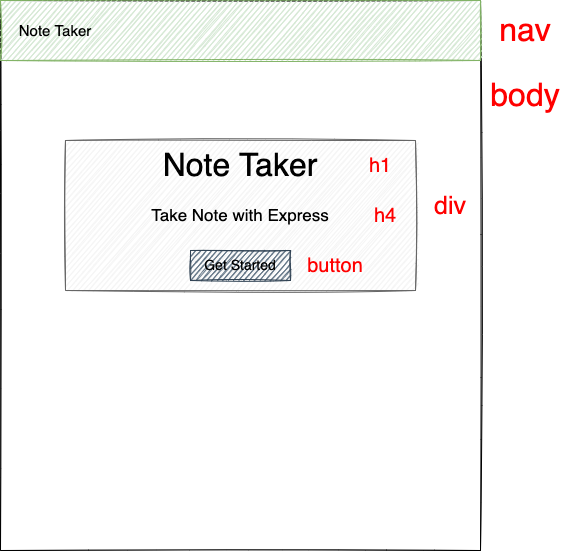
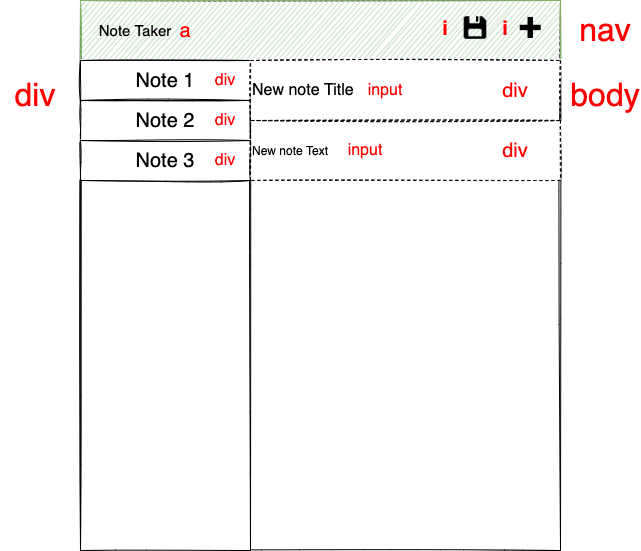
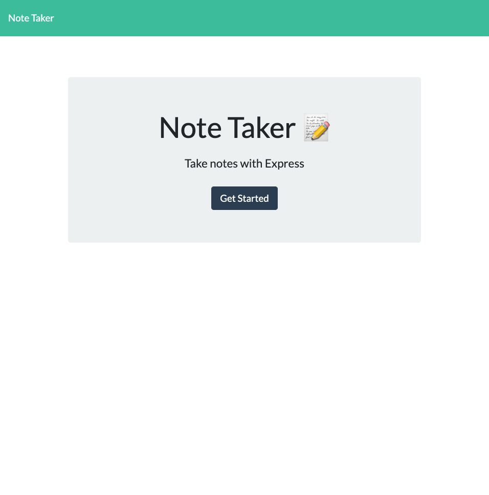
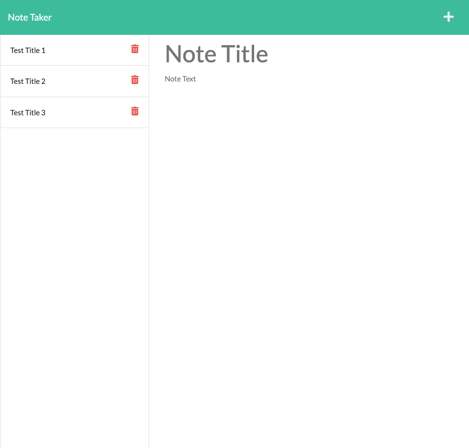

<h1>Note Taker</h1>

## Links

- Deployed Heroku link [here](https://intense-headland-42686.herokuapp.com/)

<h2>Table of Contents</h2>

- [Description](#description)
- [User Story](#user-story)
- [Technologies Used](#technologies-used)
- [Endpoints](#endpoints)
  - [Get /notes](#get-/notes)
  - [Post /note](#post-/note)
  - [Delete /note](#delete-/note)
- [Screenshots](#screenshots)
  - [Wireframes](#wireframes)
  - [Final Website](#final-website)
- [Video Walkthrough](#video-walkthrough)
- [Questions](#questions)

## Description

Note Taker is a application that that can be used to write and save notes. This application will use an Express.js back end and will save and retrieve note data from a JSON file.

## User Story

```md
GIVEN a note-taking application
WHEN I open the Note Taker
THEN I am presented with a landing page with a link to a notes page
WHEN I click on the link to the notes page
THEN I am presented with a page with existing notes listed in the left-hand column, plus empty fields to enter a new note title and the note’s text in the right-hand column
WHEN I enter a new note title and the note’s text
THEN a Save icon appears in the navigation at the top of the page
WHEN I click on the Save icon
THEN the new note I have entered is saved and appears in the left-hand column with the other existing notes
WHEN I click on an existing note in the list in the left-hand column
THEN that note appears in the right-hand column
WHEN I click on the Write icon in the navigation at the top of the page
THEN I am presented with empty fields to enter a new note title and the note’s text in the right-hand column
```

## Technologies Used

#### Languages

- HTML5
- CSS
- JavaScript
- JQuery

#### Frameworks used

- Bootstrap CSS Framework
- Google Fonts CDN
- Font Awesome

#### Packages used

- Node.Js
- Express
- UUID

## Endpoints

### /api

#### - GET /notes

This endpoint is for users who want to get all the notes saved previously. It will return an array of notes

Sample endpoint with parameters:

```
https://intense-headland-42686.herokuapp.com/notes
```

The response contains these elements:

- id
- title
- text

See sample response:

```json
[
  {
    "id": "4d2ca0f3-597d-488a-80c7-a8aad04c9b91",
    "title": "Test Title",
    "text": "Test text"
  },
  {
    "id": "26d33b16-7277-45f1-b8ec-8acdd5b6fec7",
    "title": "Test Title",
    "text": "Test text"
  }
]
```

#### - POST /notes

This endpoint is for users who want to save a new note to your saved notes. It will create a new note.

The response contains these elements:

- title
- text

POST body:

```json
{
  "title": "your title",
  "text": "your text"
}
```

#### - DELETE /notes/:id

This endpoint is for users who want to delete an specific note from your saved notes. It will return an updated array of notes

The response contains these elements:

- id
- title
- text

See sample response:

```json
[
  {
    "id": "4d2ca0f3-597d-488a-80c7-a8aad04c9b91",
    "title": "Test Title",
    "text": "Test text"
  }
]
```

## Screenshots

### Wireframes





### Final Website





## Questions

If you have any question or suggestion, please fell free to get in touch with me by:

Email: [luizfroes@gmail.com](mailto:luizfroes@gmail.com)

GitHub: [luizfroes](https://github.com/luizfroes)
